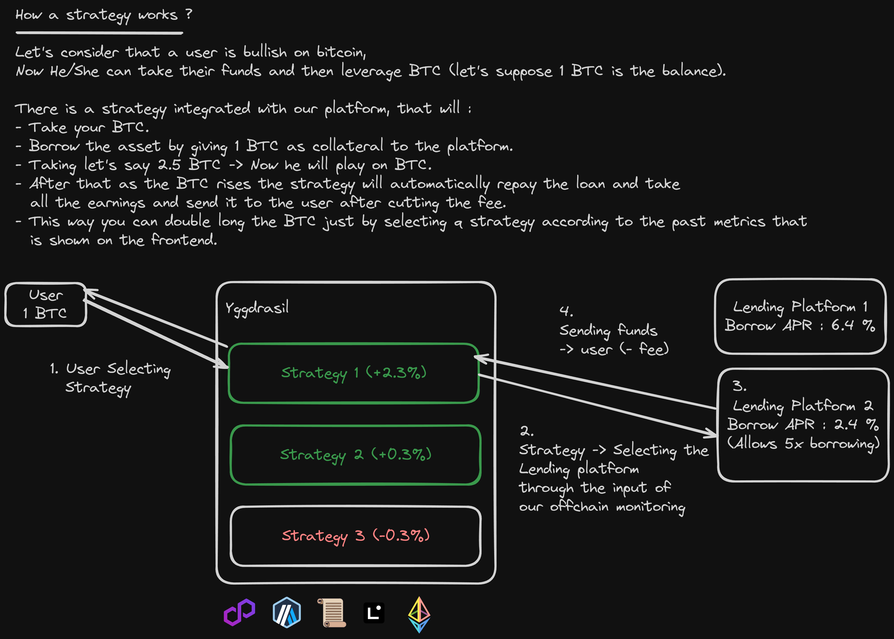
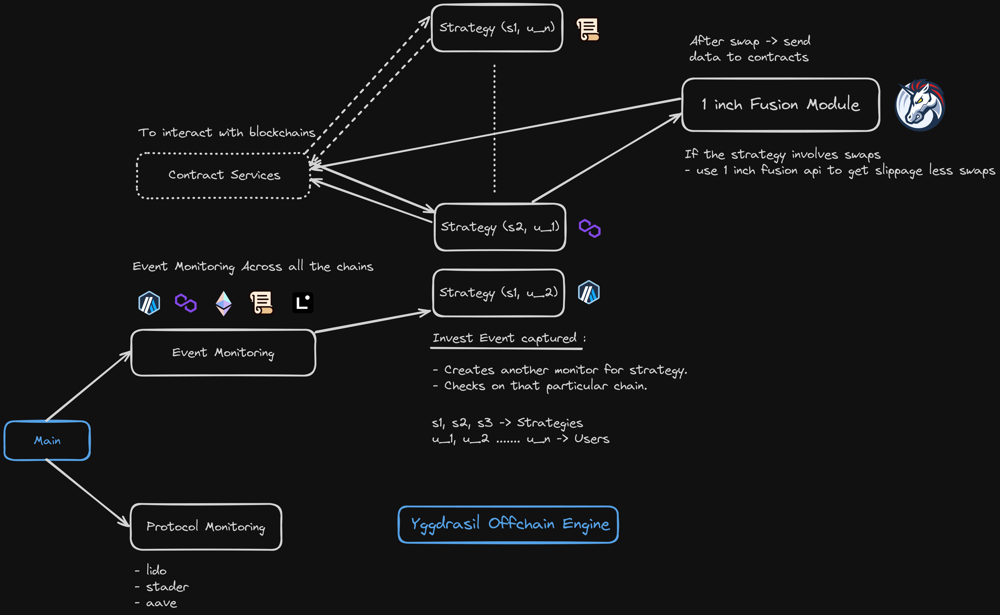

# Yggdrasil


**"We cover everything present in the all nine worlds"**

🌟 **Explore Yggdrasil**: Your Cross-Chain Gateway to Winning Strategies! 🚀

Join us across 5 chains — `Arbitrum`, `Linea`, `Polygon Mumbai`, `Polygon zkEVM`, and `Scroll` — to invest your funds wisely. With Yggdrasil, dive into top-performing strategies of the moment! 📈💡
Unlock the potential of multi-chain investing and be part of the future in strategy management! 🌈✨

## Index

- [Yggdrasil](#yggdrasil)
  - [Index](#index)
  - [How we add strategies ?](#how-we-add-strategies-)
  - [Mechanism](#mechanism)
    - [Backend](#backend)
    - [Smart Contracts](#smart-contracts)
  - [Deployed Addresses](#deployed-addresses)
    - [Scroll Sepolia](#scroll-sepolia)
    - [Linea Goerli](#linea-goerli)
    - [Arbitrum Goerli](#arbitrum-goerli)
  - [Future Scope](#future-scope)
    - [Team : Valhalla](#team--valhalla)

## How we add strategies ?

As we know their are several people in blockchain space who are expert in trading and are generating a good amount of profit.

- Now these traders can design a basic strategy contract and send to us for an audit.
- After they send the contract we audit it and convert that into the `Strategy` contract that will be deployed on a chain according to the strategy which is mentioned in the contract.

## Mechanism

Let's see how a strategy works using a HLD (High Level Diagram)



**We are also using `One Inch Fusion API` in order to swap to the tokens according to the strategy which the user has chosen to invest in.**

### Backend

**Backend Monitoring System Diagram :**



**Know more :** [Offchain HLD and Docs](./backend/Readme.md)

### Smart Contracts

**Contract Interation :**


**Know more :** [Contracts HLD and Docs](./smart-contracts/README.md)

## Deployed Addresses

#### Scroll Sepolia

```sh
Vault : 0x4401DE98fE700c5E2c62b2f2C6BeD4AEE135fC58
Strategy Manager : 0x5B7d72e1B7EDfF99153fE0b722548B154E7c86f1
Strategy Scroll : 0x2E1042A93a8657Bad5BcBFa88F59a59abE42f7d2
```

#### Linea Goerli

```sh
Vault : 0x5f10546E9316CA9380A2b00a78b78D3C3e7E7340
Strategy Manager : 0x88c8627816361f1438C8D4C692647BbCc96FF50d
Strategy Linea : 0x83EfCf6d2C4FD9ED637BF9da8dD19174308d532B
```

#### Arbitrum Goerli

```sh
Strategy Manager : 0x83E6B164C6D130567316cECF3Bc7879203772943
Strategy 3 : 0x938c795358fD433aDdbd1374eCe2aD69D61a31F2
```

## Future Scope

- `Goal` : Our intent behind this project was to provide the community to build upon each other's ideas. That is why we have structured our strategies to be used as building blocks which can be chained together to make something much more complex and innovative

- `Cross Chain` : Scope of these strategies was not only planned to be limited to single chains. We also wanted to harness the potential of cross chain communication to allow the users to spend their portfolio on any chain of their choosing and strategy of their choosing.

- `Motivation` : As proud members of Team Valhalla, our mission is to create a platform that significantly contributes to the community. We aim for our actions to echo in the golden halls of the Aesir, so when we reach Valhalla, the gods will cheer for us and share our stories.

🛡️ Join us on our noble quest to build a platform that leaves a lasting impact on the community. Together, let's forge a legacy that resonates in the realm of the gods! ⚔️🌟

#### Team : Valhalla

- Marc Erichnadhan Anthony
- Aniruddha Dhumal
- Zeaphrine Islary
- Arun Jangra
- Venkat Teja
