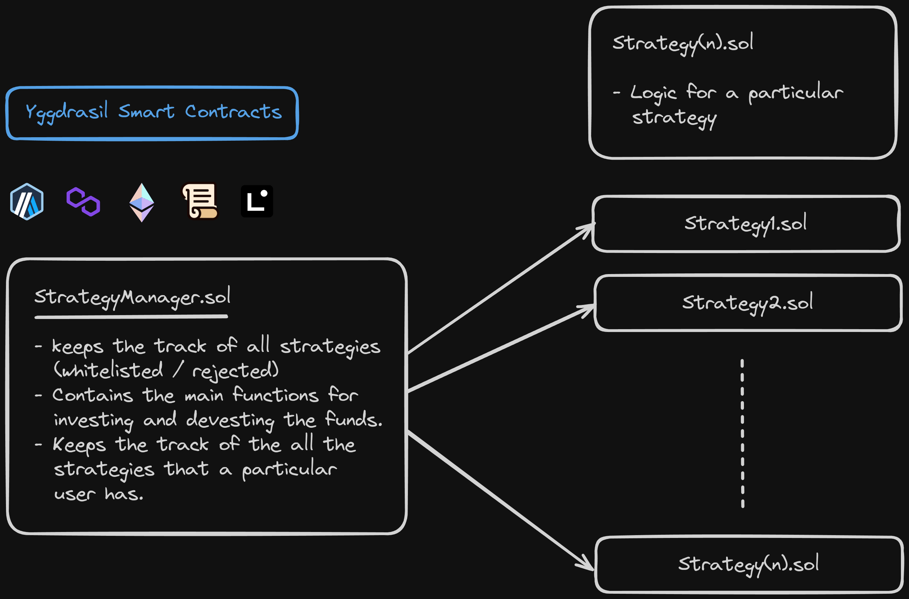

# Yggdrasil-Smart-Contracts

This folder contains the on chain logic of the strategies and the implementation of yggdrasil.



### Components

- `StrategyManager.sol` : This contract will keep the track of all the strategies (whitelisted / rejected). It will also keep track of all the strategies that a user is involved in.

- `Strategy.sol` : This is the contract that will have the logic of the strategy made by the strategist.

**We will audit the strategies ourselves before integrating it with our product.**

### Setup

```sh
touch .env
```

`.env`

```sh
PRIVATE_KEY=""
RPC_URL_ETH=""
.
.
.
.
.
# for all the chains
```

```sh
yarn hardhat compile
yarn hardhat deploy --network <network_name>
```

### Future Scope

- Allow users to chain the strategies together to maximise their profit.
- Allow the integration of the strategy into our platform through decentralised voting that can be achieved by DAO(Decentralised Autonomous Organisation) model.
