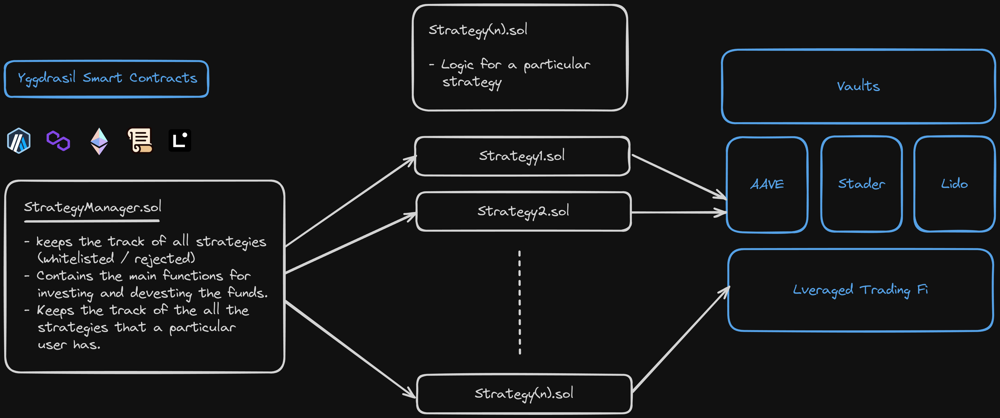

# Yggdrasil-Smart-Contracts

This folder contains the on chain logic of the strategies and the implementation of yggdrasil.



## Index

- [Yggdrasil-Smart-Contracts](#yggdrasil-smart-contracts)
  - [Index](#index)
  - [Components](#components)
  - [Deployed Addresses](#deployed-addresses)
    - [Scroll Sepolia](#scroll-sepolia)
    - [Linea Goerli](#linea-goerli)
    - [Arbitrum Goerli](#arbitrum-goerli)
    - [Scroll Sepolia](#Polygon-zkEVM)
    - [Base Goerli](#Base-Goerli)
  - [Setup](#setup)
  - [Future Scope](#future-scope)

## Components

- `StrategyManager.sol` : This contract will keep the track of all the strategies (whitelisted / rejected). It will also keep track of all the strategies that a user is involved in.

- `Strategy.sol` : This is the contract that will have the logic of the strategy made by the strategist.

**We will audit the strategies ourselves before integrating it with our product.**

## Deployed Addresses

#### Scroll Sepolia

```sh
Vault : 0x4401DE98fE700c5E2c62b2f2C6BeD4AEE135fC58
Strategy Manager : 0x08b59B9c3aAB242745f603F68eA6F992aaF473C0
Strategy Scroll : 0x5B7d72e1B7EDfF99153fE0b722548B154E7c86f1
"ManagerVerification": "https://sepolia-blockscout.scroll.io/address/0x08b59B9c3aAB242745f603F68eA6F992aaF473C0/contracts#address-tabs"

```

#### Linea Goerli

```sh
Vault : 0x5f10546E9316CA9380A2b00a78b78D3C3e7E7340
Strategy Manager : 0x88c8627816361f1438C8D4C692647BbCc96FF50d
Strategy Linea : 0x83EfCf6d2C4FD9ED637BF9da8dD19174308d532B
```

#### Arbitrum Goerli

```sh
Vault : 0x08b59B9c3aAB242745f603F68eA6F992aaF473C0
Strategy Manager : 0x19d12870077DDb6C53FbDeF6818ED504e63b23Ab
Strategy Arbitrum : 0x5f10546E9316CA9380A2b00a78b78D3C3e7E7
```

#### Polygon zkEVM

```sh
Vault : 0x83E6B164C6D130567316cECF3Bc7879203772943
Strategy Manager : 0x938c795358fD433aDdbd1374eCe2aD69D61a31F2
Strategy Arbitrum : 0xD54c7403F7f5c2dFEA07669C6b9b52F6bdc21AE5
```

#### Base Goerli

```sh
Vault : 0x938c795358fD433aDdbd1374eCe2aD69D61a31F2
Strategy Manager : 0xD54c7403F7f5c2dFEA07669C6b9b52F6bdc21AE5
Strategy Arbitrum : 0x4401DE98fE700c5E2c62b2f2C6BeD4AEE135fC58
```

## Setup

```sh
touch .env
```

`.env`

```sh
PRIVATE_KEY=""
RPC_URL_ETH=""
.
.
.
.
.
# for all the chains
```

```sh
yarn hardhat compile
yarn hardhat deploy --network <network_name>
```

## Future Scope

- Allow users to chain the strategies together to maximise their profit.
- Allow the integration of the strategy into our platform through decentralised voting that can be achieved by DAO(Decentralised Autonomous Organisation) model.
